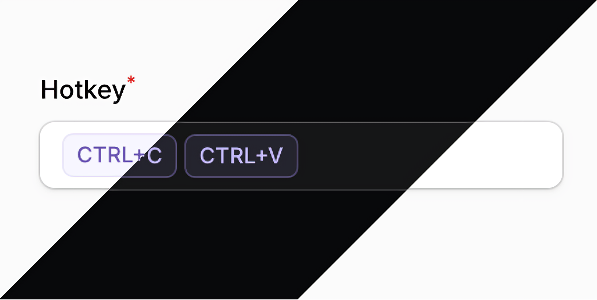
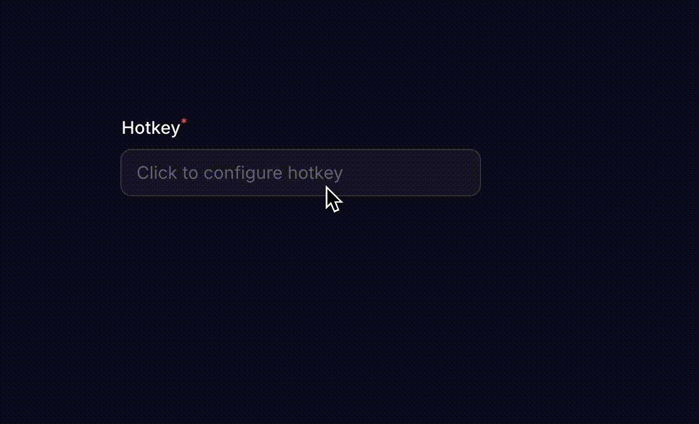

<p align="center">
    
</p>

<h1 align="center">Filament Shortcuts</h1>

<p align="center">
    Let users press keys to create custom keyboard shortcuts
</p>

<p align="center">
    <a href="https://packagist.org/packages/aqjw/shortcuts">
        
    </a>
    <a href="https://packagist.org/packages/aqjw/shortcuts">
        
    </a>
</p>

---

## 🎬 Demo

<p align="center">
    
</p>

Just press any key combination and it gets saved automatically. Great for apps where users need their own custom shortcuts.

**Powered by [Mousetrap](https://github.com/ccampbell/mousetrap)** - A simple library for handling keyboard shortcuts in JavaScript.

## 📦 Installation

You can install the package via Composer:

```bash
composer require aqjw/shortcuts
```

## 🎨 Registering Styles
In order for component styles to be processed, you must add this package's views to your Tailwind CSS configuration:

```js
// tailwind.config.js
export default {
    content: [
        './resources/**/*.blade.php',
        './vendor/filament/**/*.blade.php',
        './vendor/aqjw/shortcuts/resources/views/**/*.blade.php',
    ],
}
```

## 🚀 Usage

### Basic Usage

```php
use Aqjw\Shortcuts\ShortcutInput;

ShortcutInput::make('shortcut')
    ->label('Keyboard Shortcut')

// The field stores data as an array:
['ctrl+c', 'ctrl+v']
['alt', 'f4']
['f12']
```

## ⚙️ Configuration Options

| Method | Description | Default |
|--------|-------------|---------|
| `combinations(int)` | Maximum number of key combinations to record | `1` |
| `timeout(int)` | Timeout in milliseconds for recording | `700` |
| `instruction(string)` | Instruction text shown while recording | Localized text |
| `placeholder(string)` | Placeholder text when no shortcuts is set | Localized text |


## 🌍 Internationalization

The package supports 12 languages out of the box:

- 🇨🇳 Chinese (`zh`)
- 🇳🇱 Dutch (`nl`)
- 🇺🇸 English (`en`)
- 🇫🇷 French (`fr`)
- 🇩🇪 German (`de`)
- 🇮🇹 Italian (`it`)
- 🇯🇵 Japanese (`ja`)
- 🇰🇷 Korean (`ko`)
- 🇵🇹 Portuguese (`pt`)
- 🇷🇺 Russian (`ru`)
- 🇪🇸 Spanish (`es`)
- 🇺🇦 Ukrainian (`uk`)


## 📝 Changelog

Please see [CHANGELOG](CHANGELOG.md) for more information on what has changed recently.

## 🤝 Contributing

Please see [CONTRIBUTING](.github/CONTRIBUTING.md) for details.

## 🔒 Security Vulnerabilities

Please review [our security policy](../../security/policy) on how to report security vulnerabilities.

## 👥 Credits

- [Anton Shever](https://github.com/aqjw)
- [All Contributors](../../contributors)

## 📄 License

The MIT License (MIT). Please see [License File](LICENSE.md) for more information.
